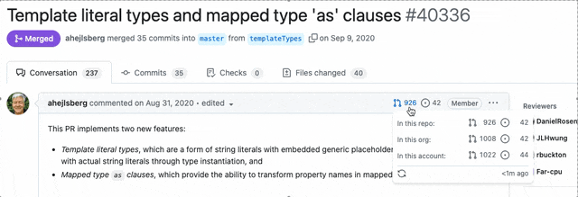
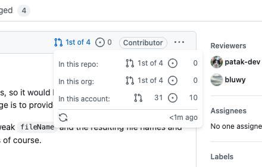

# Contributors on Github

A browser extension that shows contributor information on GitHub pull requests, including whether it's a user's first contribution.

### Download

[link-chrome]: https://chrome.google.com/webstore/detail/github-contributor-stats/cjbacdldhllelehomkmlniifaojgaeph?hl=en 'Version published on Chrome Web Store'
[link-firefox]: https://addons.mozilla.org/en-US/firefox/addon/contributor-on-github/ 'Version published on Mozilla Add-ons'

[][link-chrome] [][link-chrome] also compatible with [][link-chrome] [][link-chrome]

[][link-firefox] [][link-firefox]

## Features

- [x] Shows the number of Issues/PRs a user has made to a specific repository, org, account
- [x] ~~Displays "First-time contributor" badge for new contributors~~ GitHub does this now!
- Works on any GitHub page with pull requests or issues
- Data is cached for better performance

### Local Installation

#### Chrome/Edge/Brave/Opera

1. Clone or [download](https://github.com/hzoo/contributors-on-github/archive/refs/heads/master.zip) this repository
2. Go to `chrome://extensions/`
3. Enable "Developer mode" in the top-right corner
4. Click "Load unpacked"
5. Select the `src` folder from this repository

#### Firefox

1. Clone or download this repository
2. Go to `about:debugging#/runtime/this-firefox`
3. Click "Load Temporary Add-on…"
4. Select the `manifest.json` file in the `src` folder

## Usage

Once installed, the extension works automatically when you visit GitHub pull requests or issues. It injects contributor information inline, showing the number of PRs a user has made to that specific repository.

You can click on `🔄` to refresh the data if needed (data is cached in browser storage).

### GitHub API Rate Limits

- Without auth: 60 req/hr
- With auth: 5k req/hr

1. Create a token at [GitHub Settings > Developer settings > Personal access tokens](https://github.com/settings/tokens)
2. For public repos: Select the `public_repo` permission
3. For private repos: Select the `repo` permission
4. Copy/paste token in the options

## Permissions

- `github.com/*/*`: Allows extension to inject data into GitHub pages
- `api.github.com/*`: Fetch issue/PR data from GitHub's API
- `storage`: Stores your access token and caches user PR data

## Related Projects

- [Awesome browser extensions for GitHub](https://github.com/stefanbuck/awesome-browser-extensions-for-github)
- [Refined GitHub](https://github.com/sindresorhus/refined-github/)

## License

MIT
