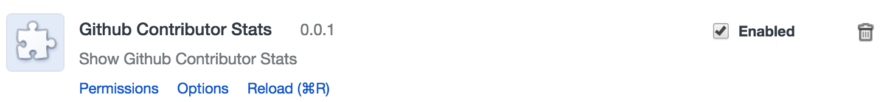

# GitHub Contributior Extension

> Mainly to show if it's a contributors first PR (right now it's specific to the repo, not in general). It adds some info to any urls that look like `https://github.com/babel/babel/pull/3376`

> Code is pretty horrible right now.
> I'm just glad it mostly works + happy to start using it (I guess for this as well)!
> Feel free to give some suggestions.

#### Usage

It can just work without setting any options, so no need to do so unless you are hitting a rate limit.

You can start from any page on `github.com` and when you navigate to a specific pull request (like https://github.com/babel/babel/pull/3331), it will inject the info about the # of PRs a user has made to that specific repo.

You can click on `[Update PRs]` to update the number if it has changed (since the number is cached with `chrome.sync.storage`).

---

You may want to create or get a "access token" that uses the `public_repo` permission if you want to use a 30/min rate limit instead of 10/min (might not be necessary).

#### Permissions
- "activeTab": to add the first PR text to the active tab
- "storage", to store access token, cache user PR data
- "webNavigation", to listen for `History.pushState` events
    - The [content script](src/index.js) was matching `"https://github.com/*/*/pull/*` which is correct, but if you start from the hompage, then the script won't ever be injected since github is using pushState to change urls. Now it will match `https://github.com` and then check for the specific url.
 
#### Local Install
- Download the zip, and unzip it

- Go to [`chrome://extensions/`](chrome://extensions/)
- Click on `Load unpacked extension...`
- Select the `src` folder of the unzipped folder you downloaded

You should see

Now try it out!

You can also click on the Options to set your `access_token` if you need to!

Used https://github.com/GoogleChrome/chrome-app-samples/tree/master/samples/github-auth, https://github.com/ekonstantinidis/gitify, https://github.com/sindresorhus/notifier-for-github-chrome for reference.

#### LICENSE
MIT

