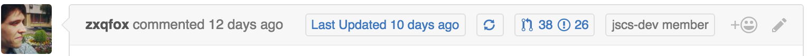

  

# Contributors on Github

---

The original idea was to show if it's a contributors first PR on the pull request page such as https://github.com/babel/babel/pull/3283.

Much thanks to @Pocket-titan and @djrosenbaum for working on the logo 🖼!

---

## Usage

You can start from any page on `github.com` and when you navigate to a specific issue/pull request (such as https://github.com/babel/babel/pull/3331), it will inject information inline (like the # of PRs a user has made to that specific repo).

You can click on `🔄` to update the data if it has changed (it is cached in chrome storage).

If necessary, you may want to create or get a "access token" that uses the `public_repo` permission if you want to use a 30/min rate limit instead of 10/min.

> If you want to use this on private repos then you'll need to add the `repo` permission instead. I would recommend installing locally for this.

---

## Permissions

- "https://github.com/*/*": to be able to inject data into github
  - The [content script](src/content.js) was matching `"https://github.com/*/*/pull/*` which is correct, but if you start from the hompage, then the script won't ever be injected since github is using pushState to change urls. Now it will match `https://github.com` and then check for the specific url.
- "storage", to store access token, cache user PR data.
- "identity", to create an oauth request window.
 
---

## Install

> I would recommend installing locally to try new features first (it's easy to update/revert/modify yourself) by just `git pull`.

- [Chrome extension](https://chrome.google.com/webstore/detail/github-contributor-stats/cjbacdldhllelehomkmlniifaojgaeph?hl=en)

---

## Local Install

- Download the zip, and unzip it

- Go to [`chrome://extensions/`](chrome://extensions/)
- Click on `Load unpacked extension...`
- Select the `src` folder of the unzipped folder you downloaded

Now try it out!

---

## References

- https://github.com/GoogleChrome/chrome-app-samples/tree/master/samples/github-auth
- https://github.com/sindresorhus/notifier-for-github-chrome

---

## License

MIT

